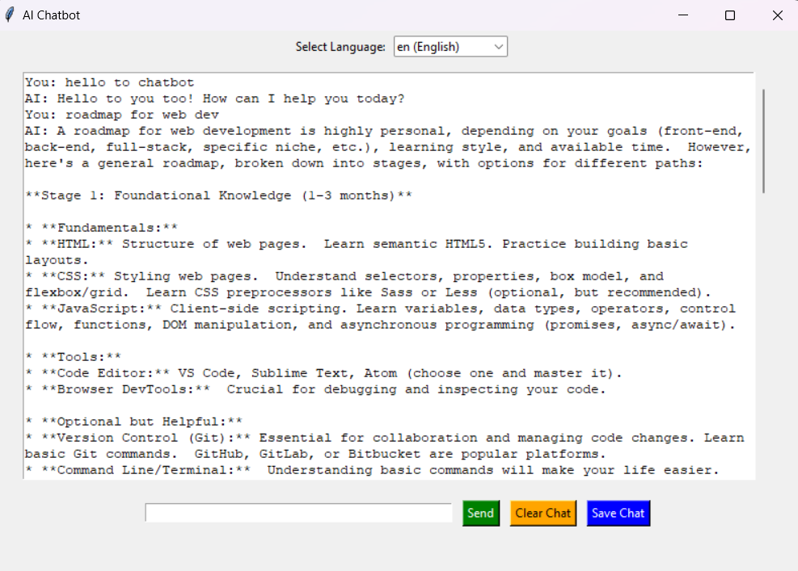

# AI Chatbot 🤖

An AI Chatbot is a desktop application that enables users to interact with an AI-powered chatbot in multiple languages and get their query solved. It features a user-friendly interface, supports language translation, and has options to save and clear chat logs.

## Features🚀

- 🌏Multiple Language Support: It can communicate in five different  languages, namely English, Spanish, French, German, and Hindi.
- 💾Save chat logs: Export your chat conversations to a `.txt` file for future reference.
- 🗑️Delete chat logs: Reset the chat window with a single click.
- 🤖Responsive AI: Intelligent response powered by Google Generative AI.
  


## Installation🛠️
### Prerequisites
- Python 3.x.
- Google Generative AI API key.

### Steps
1. Clone the repository:
```bash
 git clone https://github.com/yourusername/chatbot.git
 cd chatbot
```
2. Install the required dependencies:
```bash
pip install -r requirements.txt
```
3. Set up the API key:
- Open the chatbot.py file.
- Replace YOUR_API_KEY with your actual Google Generative AI API key.
4. Run the chatbot:
```bash
python chatbot.py
```
  

## Usage💡
1. Launch the Chatbot: Run the application to open the chatbot window.
2. Select a Language: Use the dropdown menu to choose your preferred language.
3. Chat with AI: Type your message in the input field and press Enter or click Send.
4. Save the Conversation: Click the Save Chat button to save the chat log to a .txt file.
5. Clear Chat: Click the Clear Chat button to reset the chat window.


## Screenshots


## Tech Stack

1. Python: Core programming language for logic and GUI.
2. Tkinter: For building the graphical user interface.
3. Google Generative AI: Provides intelligent chatbot responses.
4. GoogleTrans: Enables multilingual translation.


## Authors🧑‍💻

- [Aniket Jain](https://github.com/Aniket-Jain12)

